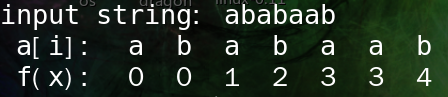

# 3.6 节的练习

### 3.6.1

3.4 节的练习中图 3-19 计算了 KMP 算法的失效函数。说明在已知失效函数的情况下，如何根据已知的关键字 b_1b_2…b_n 构造出一个具有 n+1 个状态的 DFA，该 DFA 可以识别语言 .*b_1b_2…b_n 。更近一步，证明构造这个 DFA 的时间复杂度为 O(n)。

#### 解答

为方便说明，以 3.4.3-3 的字符串 abababb 为例，失效函数为：

DFA伪代码:
	
	int i;
		for(i = 0; i < len; ){
			if(c_in == b1b2...bn[i]) 
				++i;
			else 
				i = f(i);
		}
