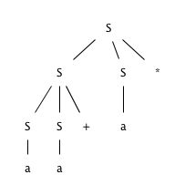

#NFA构造同样的文法

1.	对于NFA每个状态i,创建一个非终结符号A
2.	对于状态i，如果有符号a到状态j的转义，就创建Ai->aAj.如果输入∈达到状态j就创建Ai->Aj
3.	如果i是接受状态就创建Ai->∈
4.	如果i是自动机开始符号就令Ai为文法的开始符号

##4.2

###4.2.1
考虑上下文无关文法：
	S -> S S + | S S * | a
	以及串 aa+a*

1.	给出这个串的一个最左推导: 
	S=lm=>SS*=lm=>SS+S*=lm=>aS+s*...=>aa+a*
2.	给出这个串的一个最右推导: 
	S=rm=>SS*=rm=>Sa*=rm=>SS+a*...=>aa+a*
3.	给出这个串的一个语法分析树: 
	
4.	这个文法是否为二义性的？证明你的回答: 
	因为*和+两个终结符号会决定采用前两天句型的顺序，所以无二义性
5.	描述这个语法生成的语言: 
	乘法加法的后缀表达式
	
###4.2.2

对下列的每一对文法和串重复练习 4.2.1 。

1.	S -> 0 S 1 | 0 1 和串 000111
2.	S -> + S S | * S S | a 和串 +*aaa
3.	! S -> S (S) S | ε 和串 (()())
4.	! S -> S + S | S S | (S) | S * | a 和串 (a+a)*a
5.	! S -> (L) | a 以及 L -> L, S | S 和串 ((a,a),a,(a))
6.	!! S -> a S b S | b S a S | ε 和串 aabbab
7.	下面的布尔表达式对应的文法： 
	bexpr -> bexpr or bterm | bterm 
	bterm -> bterm and bfactor | bfactor 
	bfactor -> not bfactor | (bexpr) | true | false 

回答：	
1. 
	S =lm=> 0S1 => 00S11 => 000111 
	S =rm=> 0S1 => 00S11 => 000111 
	略 
	非二义 
	前导n个连续0，后跟n个连续1的串 
	
2. 
	S =lm=> +SS => +*SSS => +*aSS => +*aaS => +*aaa 
	S =rm=> +SS => +Sa => +*SSa => +*Saa => +*aaa 
	略 
	非二义 
	加法、乘法的前缀表达式 
	
3. 
	S =lm=> S(S)S => (S)S => (S(S)S)S => ((S)S)S => (()S)S => (()S(S)S)S => (()(S)S)S => (()()S)S => (()())S => (()()) 
	S =rm=> S(S)S => S(S) => S(S(S)S) => S(S(S)) => S(S()) => S(S(S)S()) => S(S(S)()) => S(S()()) => S(()()) => (()()) 
	略 
	二义 
	所有对称的括号串 
	
4. 
	S =lm=> SS => S*S => (S)*S => (S+S)*S => (a+S)*S => (a+a)*S => (a+a)*a 
	S =rm=> SS => Sa => S*a => (S)*a => (S+S)*a => (S+a)*a => (a+a)*a 
	略 
	二义 
	由加号、乘号和字符a和对称的括号组成的串，且加号不在开头和结尾位置，乘号不在开头位置 
	
5. 
	&nbsp; S =lm=> (L) => (L, S) => (L, S, S) => ((S), S, S) => ((L), S, S) => ((L, S), S, S) => ((S, S), S, S) => ((a, S), S, S) => ((a, a), S, S) => ((a, a), a, S) => ((a, a), a, (L)) => ((a, a), a, (S)) => ((a, a), a, (a)) 
	S =rm=> (L) => (L, S) => (L, (L)) => (L, (a)) => (L, S, (a)) => (L, a, (a)) => (S, a, (a)) => ((L), a, (a)) => ((L, S), a, (a)) => ((S, S), a, (a)) => ((S, a), a, (a)) => ((a, a), a, (a)) 
	略 
	非二义 
	类似于python中的元组 
		
6. 
	S =lm=> aSbS => aaSbSbS => aabSbS => aabbS => aabbaSbS => aabbabS => aabbab 
	S =rm=> aSbS => aSbaSbS => aSbaSb => aSbab => aaSbSbab => aaSbbab => aabbab 
	略 
	二义 
	数量相同的a和b组成的串 
	
7. 
	非二义，该文法生成布尔表达式 